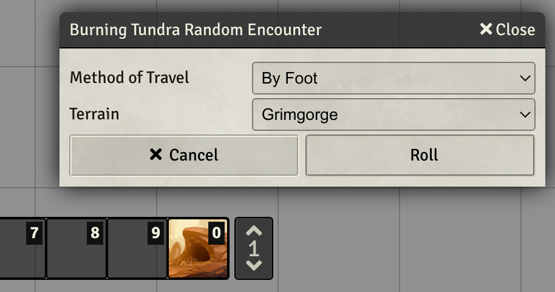
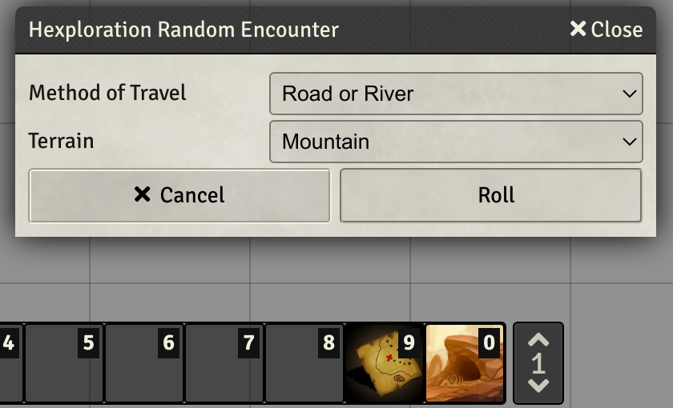

# Quest for the Frozen Flame Tools (Unofficial)

Tools for running book 3 of Quest for the Frozen Flame

Uses the [Open Gaming License](./OpenGameLicense.md) and [CUP](https://paizo.com/community/communityuse)

> This FoundryVTT module uses trademarks and/or copyrights owned by Paizo Inc., used under Paizo's Community Use Policy (paizo.com/communityuse). We are expressly prohibited from charging you to use or access this content. This FoundryVTT module is not published, endorsed, or specifically approved by Paizo. For more information about Paizo Inc. and Paizo products, visit paizo.com.

## Installation

The package is available through the [module registry](https://foundryvtt.com/packages/pf2e-qftff-tools)

### Git

Clone this repository into your installation's module folder:

    cd ~/.local/share/FoundryVTT/Data/modules
    git clone https://github.com/BernhardPosselt/pf2e-qftff-tools.git 

Activate the module in FoundryVTT.

## Provides

### Macros

* A macro to roll random encounters for Burning Tundra
  
  

* A macro to roll random encounters from the GMG

  

### Maps

**Note**: This module does not include maps that are present in the PDF. It's expected that you use PDF2Foundry to import the PDFs to get the original maps. This module bundles all remaining maps that come up in various encounters but don't have a map which are a ton.

PS: I'm a developer first and foremost and my art skills are pretty bad ;)

* Book 1: not included, use take a look at [https://foundryvtt.com/packages/qftff-maps-remake](https://foundryvtt.com/packages/qftff-maps-remake) instead
* Book 2: complete
* Book 3: work in progress
